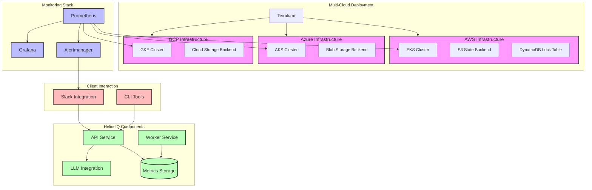

# HeliosIQ

HeliosIQ is an intelligent, AI-powered platform designed to provide personalized recommendations and insights based on user context, preferences, and behaviors. By leveraging advanced machine learning models, including external LLMs (Large Language Models), HeliosIQ helps users make more informed decisions across various applications, such as anomaly detection, personalized content recommendations, and more.

## Features

- **Anomaly Detection**: Identify unusual patterns or outliers in data to detect potential issues or opportunities.
- **Personalized Recommendations**: Generate tailored recommendations based on user-specific context and preferences using AI models.
- **LLM Integration**: Interface with large language models (LLMs) to generate contextual insights and dynamic responses.
- **Scalable Architecture**: Built with cloud-native technologies like AWS, Kubernetes, and Terraform for easy scalability and flexibility.
- **Monitoring and Observability**: Integrated with Prometheus and Grafana for system monitoring, with Helm charts for Kubernetes deployments.

## Project Structure

The project is organized into several core directories to separate concerns and maintain modularity:

- **`app/`**: Contains application logic, including API definitions, services (anomaly detection, recommendations, etc.), and utilities.
- **`infrastructure/`**: Houses all infrastructure as code (IaC) components, such as AWS resources, Kubernetes configurations, Terraform modules, and Docker setups.
- **`monitoring/`**: Includes monitoring tools and configurations (Prometheus, Grafana, Helm charts).
- **`tests/`**: Unit and integration tests for various application components.
- **`docs/`**: Documentation files related to the architecture, API specifications, and setup instructions.

## Technologies Used

- **Node.js** and **TypeScript** for backend logic and services.
- **AWS** (S3, Lambda, etc.) for cloud infrastructure.
- **Kubernetes** and **Terraform** for infrastructure management and deployment.
- **Helm** for managing Kubernetes charts.
- **Prometheus** and **Grafana** for monitoring and observability.
- **LLM Integration** for advanced AI capabilities.

## Getting Started

(Placeholder for setup instructions once the codebase is fleshed out.)

## Contributing

We welcome contributions to HeliosIQ! If you'd like to get involved, please see our [CONTRIBUTING.md](./CONTRIBUTING.md) for guidelines on how to contribute.

## License

This project is licensed under the [Apache 2.0 License](./LICENSE).

## Contact

For more information or any inquiries, please feel free to open an issue or reach out directly.

## Architecture Diagram



## Project Directory

```bash
heliosiq/
├── .github/
│   ├── workflows/
│   │   ├── ci.yml                 # Main CI pipeline
│   │   ├── release.yml            # Release workflow
│   │   └── security-scan.yml      # Security scanning workflow
├── deploy/
│   ├── terraform/
│   │   ├── aws/                   # AWS-specific infrastructure
│   │   ├── azure/                 # Azure-specific infrastructure
│   │   ├── gcp/                   # GCP-specific infrastructure
│   │   └── modules/               # Shared Terraform modules
│   ├── kubernetes/
│   │   ├── helm/
│   │   │   └── heliosiq/         # Helm chart for HeliosIQ
│   │   └── manifests/            # Raw K8s manifests if needed
│   └── docker/
│       ├── api/                   # API service Dockerfile
│       ├── worker/               # Worker service Dockerfile
│       └── monitoring/           # Monitoring stack Dockerfile
├── packages/
│   ├── core/                     # Core business logic
│   │   ├── src/
│   │   └── package.json
│   ├── api/                      # REST API service
│   │   ├── src/
│   │   └── package.json
│   ├── worker/                   # Background worker service
│   │   ├── src/
│   │   └── package.json
│   ├── monitoring/              # Monitoring integration
│   │   ├── src/
│   │   └── package.json
│   ├── llm-connector/           # LLM integration layer
│   │   ├── src/
│   │   └── package.json
│   ├── slack-bot/               # Slack integration
│   │   ├── src/
│   │   └── package.json
│   └── shared/                  # Shared utilities and types
│       ├── src/
│       └── package.json
├── config/
│   ├── prometheus/
│   │   └── prometheus.yml
│   └── grafana/
│       └── dashboards/
├── docs/
│   ├── architecture/
│   ├── deployment/
│   ├── development/
│   └── api/
├── scripts/
│   ├── setup.sh
│   └── deploy.sh
├── tests/
│   ├── e2e/
│   └── integration/
├── .gitignore
├── package.json
├── tsconfig.json
├── docker-compose.yml
└── README.md
```